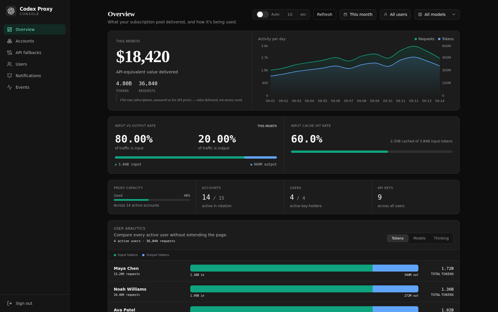
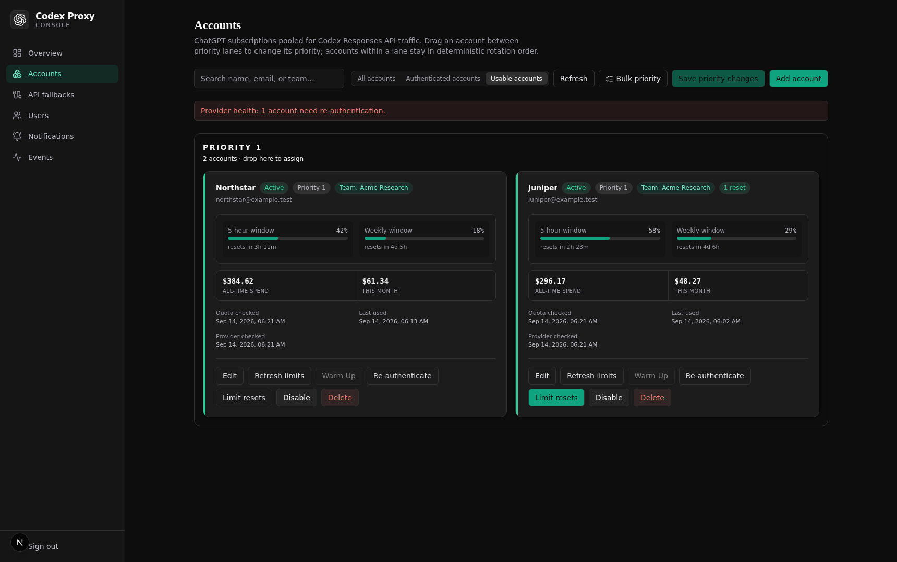
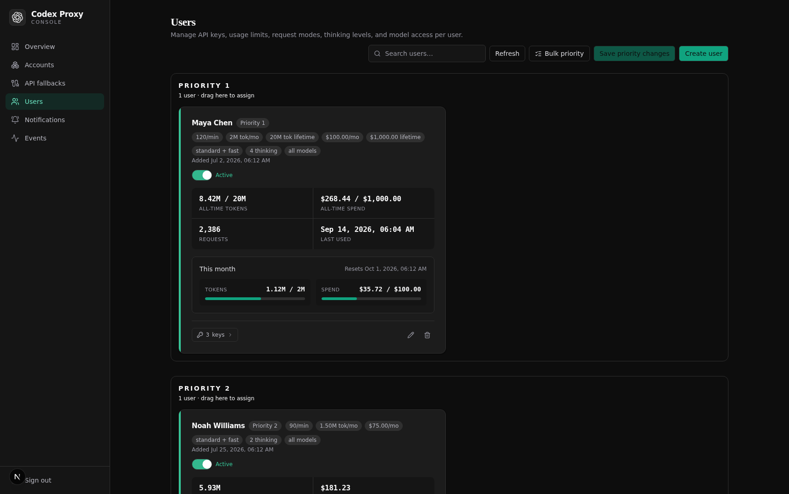
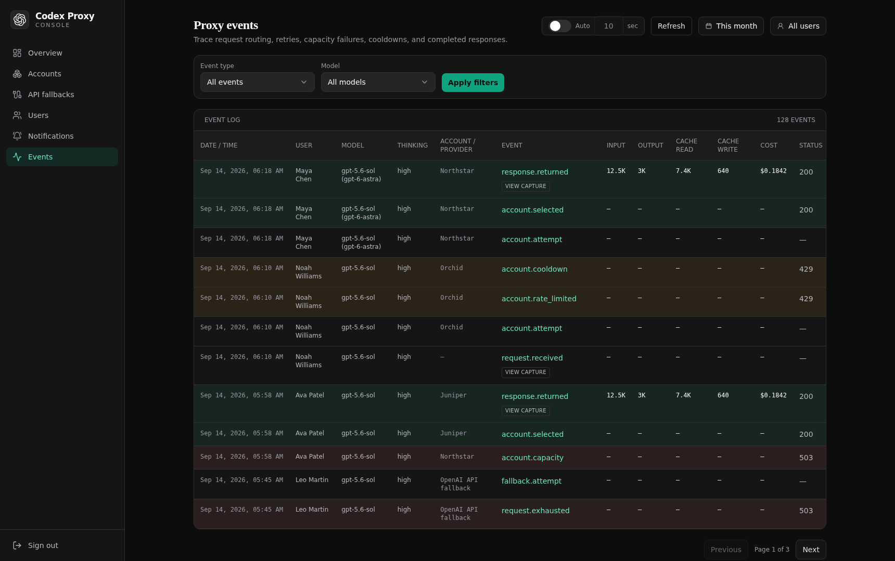
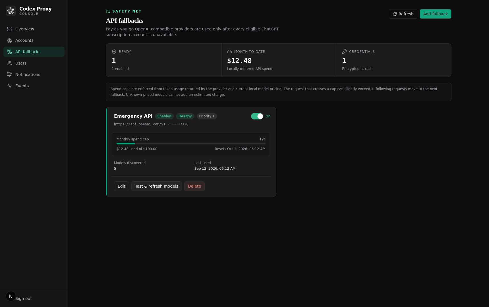
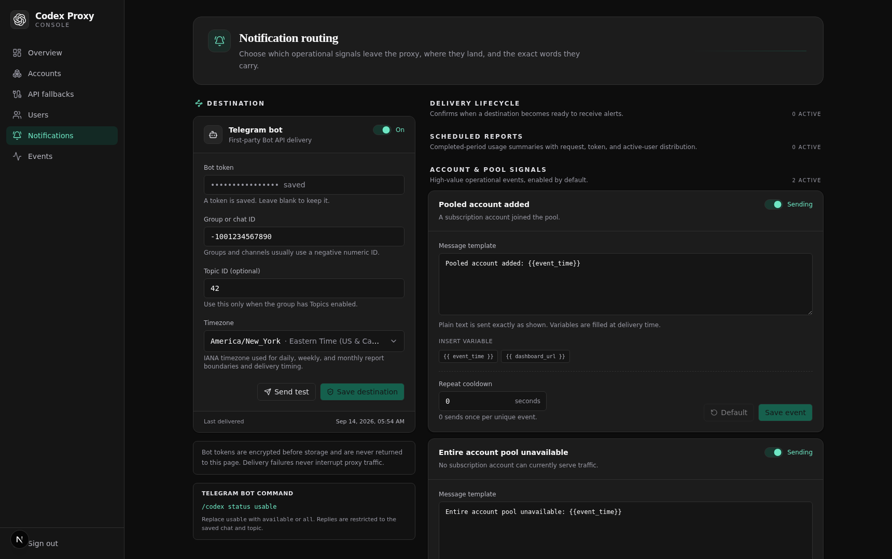

# Codex Proxy

Codex Proxy is a self-hosted, OpenAI-compatible gateway that lets a team use a
pool of authorized Codex subscription accounts through one endpoint. It handles
quota-aware routing, transparent failover, per-user policy, usage accounting,
request archives, notifications, and a responsive operations dashboard.

Looking for a Claude Code proxy instead? See the companion
[Claude Code Proxy](https://github.com/devasheeshG/claude-code-proxy).



The screenshots in this README are generated with internally consistent
synthetic data. The overview contains 4.80B tokens (3.84B input + 960M output)
across 36,840 requests, so its 80%/20% split is exact; 2.304B cached input
tokens produce the displayed 60% cache hit rate. Five-hour resets are always
less than five hours away and weekly resets are less than seven days away. No
credential, prompt, or production record is used.

> This is an independent project, not an OpenAI product. Add only accounts you
> control and are permitted to use this way; check the terms that apply to your
> organization and subscription.

## Quick start

The supported installation path is agent-assisted: copy the complete prompt in
[INSTALLATION_AGENTS.md](INSTALLATION_AGENTS.md) into your coding or infrastructure
agent. It will ask where to install, whether to use a reverse proxy, and whether
to use an existing Postgres instance before it builds, configures credentials,
creates the first user, installs the client helper, and verifies the deployment.
No manual installation steps are required.

### Optional macOS menu-bar app

If you use the dashboard from a Mac, the companion menu-bar app provides compact
Overview and Accounts views, including the same `All`, `Authenticated`, and
`Usable` account filters. The latest ad-hoc-signed build is published at the
[Codex Proxy macOS releases](https://github.com/devasheeshG/codex-proxy/releases)
page. Download `Codex-Proxy-macOS.dmg`, open the disk image, and move **Codex
Proxy.app** to Applications. This build is intended for local use; macOS may
require Control-clicking the app and choosing **Open** because it is not
notarized.

## Project status

This project was built quickly and entirely through AI-assisted development—
plainly, it was vibe-coded. I have not personally reviewed a single line of code
on `main`, so `main` should be treated as working but not human-audited software.
Review it for your own environment and risk model before putting sensitive
accounts or production traffic behind it.

That caveat is about code review, not a lack of real-world use. We have used the
proxy internally for roughly four months. During the last three months it has
handled more than 20 billion tokens and about 70,000 requests for us, and it has
been stable without known operational problems. Our experience is not a
substitute for an independent security review, but this is running software—not
an untested demo.

I intend to review the code as time permits. The `human` branch will contain only
code I have personally reviewed, so it will naturally lag behind `main`: humans
are the bottleneck now (pun intended).

## What it provides

### Reliable pooled routing

- Priority-ordered account pools; lower numeric priority is served first.
- PostgreSQL advisory-lock concurrency lanes per account, with reserved lanes
  for higher-priority users during bursts. Accounts are not pinned to users.
- Provider quota windows (five-hour, weekly, and any provider-reported windows),
  reset times, thresholds, cooldowns, and deterministic tie-breaking.
- OAuth refresh with serialized refresh-token rotation and reauthentication
  detection.
- Capacity, overload, 401, 404, 429, quota, and connection failures are handled
  before response bytes reach the client; the request advances to the next
  eligible account or fallback.
- Optional demand-triggered and manual warm-up of cold accounts.
- Codex reset-credit inspection and guarded redemption when the provider exposes
  an eligible credit.

### User and key controls

- Multiple users and multiple labelled API keys per user. Key labels are required
  and plaintext keys are shown only once.
- User priorities and bulk priority assignment, independent of account priority.
- Per-user fallback opt-in (off by default), model allowlists, exact model
  rewrites, request modes, thinking levels, and model access policies.
- Per-user monthly/lifetime token and spend budgets, plus per-key request/token
  limits and revocation.
- Hashed API keys and Fernet-encrypted OAuth/fallback credentials.

### Team access

- Create, disable, delete, and manage database-backed dashboard members from the
  **Team** page. Each member can be assigned an explicit checked list of exact
  permission strings; there are no required display names or role presets.
- Permissions are split across analytics, archived event bodies, accounts, proxy
  users, API keys, fallbacks, notifications, and team members. Mutating areas
  distinguish read, write, and delete access.
- Authorization is enforced by the API as well as navigation visibility. Unknown
  administrative routes fail closed for non-owner members.
- The environment-configured root login remains the break-glass owner. The
  dashboard deliberately does not store UI audit history or expose session
  revocation controls.

### Model catalog and compatibility

The dashboard and `GET /api/v1/models` use a deterministic local catalog, so a
client startup never waits for every pooled account to be queried. The current
Codex catalog is:

| Model | Notes |
| --- | --- |
| `gpt-5.6-luna` | Codex GPT 5.6 family |
| `gpt-5.6-sol` | Codex GPT 5.6 family |
| `gpt-5.6-terra` | Codex GPT 5.6 family |
| `gpt-6-astra` | Codex GPT 6 family |
| `gpt-6-sol` | Codex GPT 6 family |
| `gpt-6-luna` | Codex GPT 6 family |
| `codex-auto-review` | Codex browser auto-review model |

Model rewrites are shown in events as `target (requested)`, for example
`gpt-5.6-sol (gpt-6-astra)`.

Supported routes:

| Route | Purpose |
| --- | --- |
| `POST /api/v1/responses` | Native Responses API, streaming and non-streaming |
| `POST /api/v1/chat/completions` | OpenAI Chat Completions compatibility, translated upstream |
| `GET /api/v1/models` | Filtered local model catalog |
| `GET /api/v1/me/usage` | Consistent pooled five-hour/weekly usage and reset data |
| `GET /api/health` | Liveness/readiness probe |

OpenAI-compatible API fallbacks are tried only after no eligible subscription
account can serve a request. Fallbacks have their own priorities, health,
cooldowns, monthly spend caps, encrypted write-only credentials, and per-user
opt-in. The fallback feature is disabled for every user by default.

## Dashboard tour

### Overview


The overview combines pool health, request volume, token and cost totals, and
the same reusable controls used throughout the dashboard: automatic refresh,
manual refresh, local-calendar date ranges, user selection, and model selection.
Times are rendered in the viewer's local timezone and use a consistent 12-hour
format. Token values are compacted with `K`, `M`, or `B` where appropriate.

### Accounts



Accounts are displayed in priority lanes with a two-column responsive card grid.
Cards retain quota windows, spend, last use, provider checks, team/workspace,
authentication state, cooldown/degraded state, reset credits, and actions for
edit, refresh, warm-up, reauthentication, limit reset, disable, and delete.
Accounts needing reauthentication are ordered first, followed by accounts in
their normal usage order. The green action color is reserved for an action that
is currently available (including an eligible limit reset or reauthentication).

Bulk actions can assign a priority to selected accounts without changing any
other card setting.

### Users



Users use the same two-column card language as accounts. Each card shows user
priority, active state, request mode, thinking levels, allowed models, model
rewrites, API-key count, all-time and current-month tokens/spend, and configured
budgets. Drag-and-drop lanes and bulk assignment make priority changes explicit;
the save operation is atomic.

### Events and request history



Every request is an operational timeline: receipt, account attempt, selection,
capacity or rate-limit result, cooldown, fallback attempt, response, and
exhaustion. The event table is filterable by date range, user, model, and event
type, paginated, color-coded by event family, and includes model, thinking level,
account label, status codes, input/output/cache tokens, estimated cost, and
request outcome. Request IDs are intentionally not shown in the normal table.

Successful and failed requests are both retained. When request archiving is
enabled, an event can open the exact captured request and response body from
S3-compatible storage; authorization and cookie headers are never archived.

#### Event types and routing outcomes

The event log is an operational timeline. One request can produce several
events, while token usage and cost are recorded once per request and attached
to related rows by `request_id`. Do not add the cost shown on multiple event
rows together.

| Event | When it occurs | Status | What happens next |
| --- | --- | ---: | --- |
| `request.received` | An authenticated request enters routing. | — | Account selection begins. |
| `account.attempt` | A pooled subscription account is tried. | — | The request is sent upstream. |
| `account.busy` | The account's concurrency lane is full. | — | The account is skipped and another is tried. |
| `account.capacity` | The provider reports model capacity/unavailability before output. | Upstream | The account is temporarily cooled down and another is tried. |
| `account.cooldown` | The proxy records the cooldown action. | — | The account is kept out of selection temporarily. |
| `account.transient_error` | A retryable pre-output overload/server failure occurs. | Upstream | A short transient cooldown is applied; quota is not marked exhausted. |
| `account.rate_limited` | The provider reports an account/workspace quota limit. | `429` | The provider reset/retry time is used before retrying the account. |
| `account.error` | The request fails before a usable upstream response arrives. | — | The account is excluded for this request and routing continues. |
| `account.response_received` | A pooled account has returned a response candidate. | Candidate | Account failover stops and the response is processed. |
| `fallback.attempt` | A configured pay-as-you-go provider is tried after subscription accounts fail. | — | The fallback request is sent upstream. |
| `fallback.busy` | A fallback provider reaches its concurrency ceiling. | — | Another fallback provider is tried, if available. |
| `fallback.capacity` | A fallback provider reports model capacity/unavailability. | Upstream | The fallback is cooled down and another provider is tried. |
| `fallback.transient_error` | A fallback emits a retryable pre-output error. | Upstream | A short circuit-breaker cooldown is applied. |
| `fallback.error` | A fallback request fails before a response arrives. | — | The provider is marked degraded/cooling down. |
| `fallback.response_received` | A fallback provider has returned a response candidate. | Candidate | Fallback routing stops and the response is processed. |
| `response.returned` | The proxy has a final upstream response to return. | Final HTTP status | Usage is parsed and written to the usage ledger. |
| `request.exhausted` | No eligible subscription account or fallback can serve the request. | `503` | The client receives 503; pool/elevated-503 notifications may be queued. |

Operational rows can show the request's input/output/cache/cost values even
when that particular event did not consume tokens. Those values come from the
single usage record for the same request. A dash means no usage record or no
reported value; zero means a usage record exists and the provider reported no
tokens. Unknown models have no pricing entry and therefore have an estimated
cost of zero.

### API fallbacks



Fallback entries show label, provider, priority, enabled state, health, spend,
and cap. Operators can enable fallback globally or opt individual users in;
new users remain opted out until explicitly changed. Subscription traffic is
always preferred.

### Notifications



Telegram notifications use an encrypted bot token, destination/chat and
optional topic, timezone-aware schedules, per-event enablement, templates, and
repeat cooldowns. Delivery is handled by a persistent outbox worker so Telegram
latency never blocks inference. Account, pool, user/key guardrail, and daily,
weekly, and monthly report events are supported.

## Request lifecycle

```text
client key
   │
   ├─ authenticate user/key and enforce rate/token/spend budgets
   ├─ apply allowlist and exact model rewrite
   ├─ choose highest-priority eligible user lane
   ├─ choose highest-priority account with a free concurrency lane
   ├─ refresh OAuth if needed and forward the request
   ├─ on capacity/429/quota/connection/credential failure: cooldown + next account
   ├─ if the subscription pool is exhausted: optional user-enabled API fallback
   └─ stream response, record usage/cost, emit events, return consistent usage data
```

The proxy never returns an upstream capacity message after a successful retry on
another account. It only returns an error after the account and fallback budgets
are genuinely exhausted. Usage headers and `/api/v1/me/usage` use the same
pool-level calculation rather than whichever account happened to answer last.

The default ceiling is **3 concurrent requests per account**. It is deliberately
configurable and should be calibrated for the provider, subscription tier, and
model; see the TODO in `backend/app/utils/account_limiter.py` before changing it.

## First-run setup

1. In **Accounts**, start the Codex device authorization flow, approve each
   account in the displayed browser page, and complete login in the dashboard.
2. In **Users**, create a user and a labelled API key. The `usr_...` secret is
   shown once; the setup dialog can generate an installer for native Codex.
3. Configure the CLI with the generated command, or point an OpenAI-compatible
   client at `http://localhost:8080/api/v1` with `Authorization: Bearer usr_...`.
4. Add fallbacks only if you need them, and opt each user in explicitly.

The native installer edits only the proxy values in `~/.codex/config.toml`,
keeps a backup, stores the key with mode `0600`, and leaves the normal Codex
binary and `auth.json` untouched.

## Configuration

Copy `.env.example` for the complete annotated list. The most important values
are:

| Variable | Default | Purpose |
| --- | --- | --- |
| `DOMAIN` | `localhost` | Public host and CORS origin |
| `HTTP_PORT` / `HTTPS_PORT` | `8080` / `8443` | Bundled gateway ports |
| `POSTGRES_*` | — | PostgreSQL connection |
| `FERNET_KEY` | required | Encrypts OAuth and fallback credentials |
| `JWT_SECRET` | required | Signs admin sessions (at least 32 characters) |
| `ADMIN_USERNAME` | `admin` | Dashboard username |
| `ADMIN_PASSWORD` | required | Dashboard password |
| `QUOTA_REFRESH_INTERVAL_SECONDS` | `60` | Provider quota refresh interval |
| `MAX_CONCURRENT_REQUESTS_PER_ACCOUNT` | `3` | Per-account concurrency ceiling |
| `DEFAULT_KEY_RATE_LIMIT_PER_MINUTE` | `0` | Default key limit; zero means unlimited |
| `ARCHIVE_ENABLED` | `false` | Store exact request/response bodies in S3-compatible storage |
| `ARCHIVE_REQUIRED` | `true` | Fail closed when a required archive write fails |
| `WARMUP_ENABLED` | `true` | Enable demand-triggered/manual warm-up |

## Production deployment

Use the repository's blue-green script for live updates. It keeps one shared
Traefik gateway, starts the next Compose slot, waits for health checks, probes
the new API, promotes API before frontend, and drains the old slot only after
both routes identify the new generation.

```bash
scripts/blue-green.sh status
BG_COMPOSE_FILES=docker-compose.yaml:docker-compose.live.yml \
BG_URL=https://codex-proxy.example.com \
make deploy-blue-green
```

For an independent availability log during a rollout:

```bash
scripts/probe-availability.sh https://codex-proxy.example.com/api/health &
probe_pid=$!
make deploy-blue-green
kill "$probe_pid"; wait "$probe_pid" || true
```

Validate rendered Compose labels before changing containers:

```bash
BG_SLOT=blue BG_PRIORITY=1 BG_API_PRIORITY=2 \
docker compose -f docker-compose.yaml -f docker-compose.live.yml config --quiet
```

## Security and data retention

OAuth and fallback secrets are encrypted with Fernet. User keys are stored as
one-way hashes. Archived bodies are optional, compressed, and written to an
S3-compatible bucket; prompt and tool content may contain sensitive data, so
restrict bucket access and configure retention. Authorization and cookie
headers are excluded from captures. Review `SECURITY.md` before exposing the
dashboard publicly.

## Development

```bash
make verify
cd backend && uv sync && uv run pytest
cd frontend && pnpm install && pnpm lint && pnpm build
```

The main directories are `backend/` (FastAPI, SQLAlchemy, Alembic), `frontend/`
(Next.js dashboard), `clients/` (Codex setup helpers), and the Compose/deployment
files at the repository root.

## Contributing and project policy

Issues and pull requests are genuinely welcome. Feel free to open an issue for
anything that could be clearer or better, or send a PR if you want to fix or
improve something yourself.

- Use Issues for reproducible bugs, focused feature requests, and documentation
  problems. Search first, use one issue per concern, reproduce against the latest
  `main`, and include sanitized logs when relevant. There is no support SLA.
- Never disclose credentials, archived prompts, private logs, or database data in
  an issue. Report vulnerabilities through the repository's
  [private vulnerability-reporting flow](https://github.com/devasheeshG/codex-proxy/security/advisories/new).
- Small fixes and documentation PRs do not require a prior issue. Discuss large
  features, migrations, protocol changes, and architectural work in an issue
  before implementation.
- PRs branch from `main`, stay focused, include relevant tests and UI screenshots,
  update documentation, and pass backend/frontend CI. A merge into `main` does
  not mean the code received line-by-line human review; use `human` when that
  distinction matters.
- Draft PRs are welcome. There is currently no CLA; contributions are made under
  AGPL-3.0 and participation follows the Code of Conduct.

See [CONTRIBUTING.md](CONTRIBUTING.md), [SECURITY.md](SECURITY.md),
[CODE_OF_CONDUCT.md](CODE_OF_CONDUCT.md), and the
[previous detailed README](README.old.md) for the complete policy and upgrade
context.

## License

[AGPL-3.0](LICENSE). If you run a modified version as a network service, make
the corresponding source available to its users.

## Per-account egress IPs

The proxy can use several approved public egress IPs from one EC2 instance. AWS
assigns each secondary private address to the existing ENI and an Elastic IP
maps to that private address. The host boot service in `ops/aws-egress/` makes
the secondary addresses visible to Linux after reboot. The separate
`docker-compose.egress.yml` project runs one authenticated CONNECT relay per
source address; the application containers reach it through
`host.docker.internal`.

Set `EGRESS_TARGETS_JSON` in the protected `.env` with one target per relay,
then start the relay project. Each account's Edit dialog has an **Egress
network path** selector. Accounts default to (and existing accounts are
initialized to) the first enabled target in configuration order; selecting a
different target pins every provider/OAuth/quota request for that account to
it. There is no automatic rotation or cross-target failover. The selector
displays private and public address metadata but never relay credentials. Keep
the relay token out of Git and restrict its allowlist to the provider hosts
(`api.openai.com`/`chatgpt.com` for Codex).

Verify with `docker compose -f docker-compose.egress.yml ps`, the relay health
endpoint, and a provider request that returns an expected authentication error
instead of a connection error. During production updates run
`scripts/blue-green.sh`; never start a second Traefik or publish relay ports
publicly. Add or remove AWS EIPs only after confirming the ENI/private-IP
mapping and the approved company egress list.
